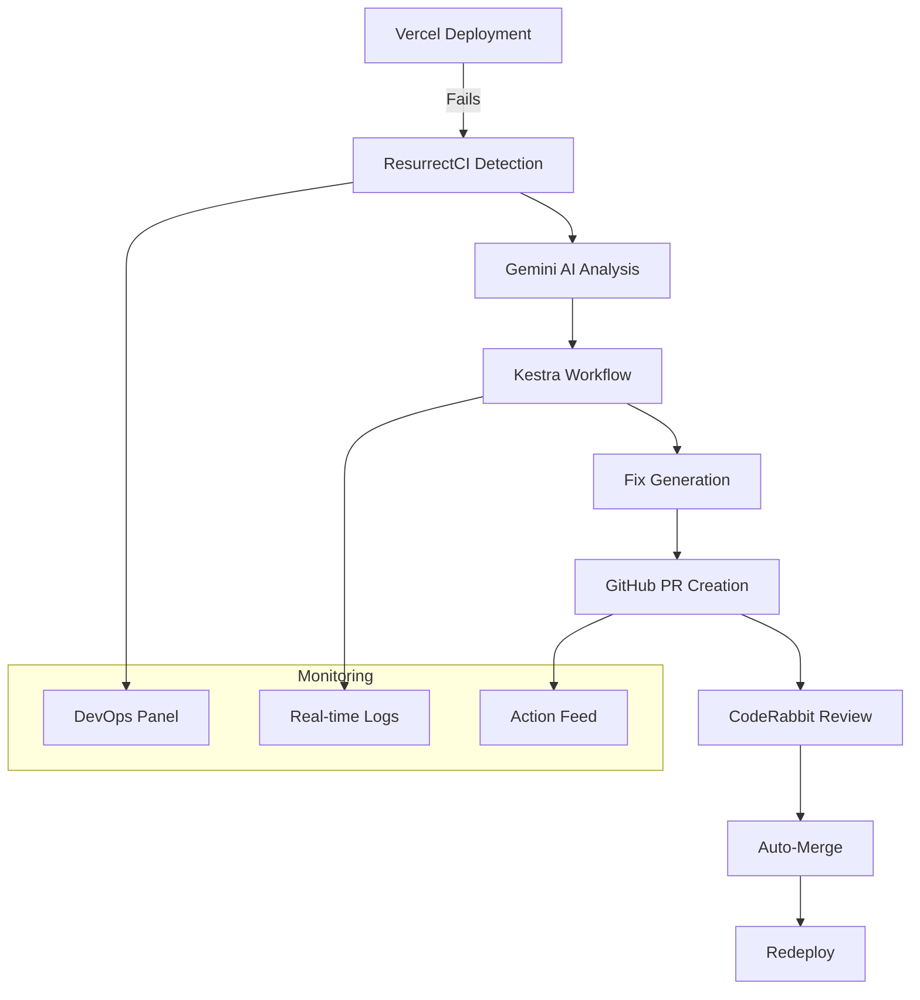

# 🤖 ResurrectCI - Autonomous DevOps Error Fixing

[](https://opensource.org/licenses/MIT)
[](https://www.typescriptlang.org/)
[](https://reactjs.org/)
[](https://kestra.io/)
[](https://coderabbit.ai/)

> **Autonomous AI-powered DevOps platform that automatically detects, analyzes, and fixes build errors without human intervention.**

## 🚀 What is ResurrectCI?

ResurrectCI is a revolutionary DevOps automation platform that **takes action** when your builds fail. Instead of just monitoring and alerting, it:

- 🔍 **Detects** build failures in real-time
- 🤖 **Analyzes** errors using Gemini AI
- 🔄 **Orchestrates** fixes using Kestra workflows
- 📝 **Creates** GitHub PRs with automated solutions
- 🐰 **Reviews** code quality with CodeRabbit
- ✅ **Auto-merges** when tests pass
- 🚀 **Redeploys** automatically

**No more broken builds sitting for hours. ResurrectCI fixes them automatically!**

## ✨ Key Features

### 🤖 **Autonomous Error Fixing**
- **Real-time detection** of Vercel deployment failures
- **AI-powered analysis** using Gemini AI for error understanding
- **Automatic code generation** to fix common build issues
- **Smart fix strategies** for dependencies, syntax, and configuration errors

### 🔄 **Workflow Orchestration**
- **Kestra integration** for complex workflow automation
- **Multi-step processes** coordinated seamlessly
- **Error handling** and retry mechanisms
- **Real-time monitoring** and progress tracking

### 📝 **GitHub Integration**
- **Automatic PR creation** with detailed fix descriptions
- **Branch management** with timestamped fix branches
- **Commit message generation** with context
- **Auto-merge** when CI/CD tests pass

### 🐰 **Code Quality Assurance**
- **CodeRabbit integration** for AI code reviews
- **Best practices enforcement** in generated fixes
- **Quality scoring** and recommendations
- **Automated code analysis** on every PR

### 🎯 **Professional DevOps Panel**
- **Real-time monitoring** of deployments and actions
- **Detailed logging** with categorized build information
- **Service connection status** for all integrations
- **One-click testing** and automation controls

## 🏗️ Architecture



## 🚀 Quick Start

### Prerequisites
- Node.js 18+
- Docker (for Kestra)
- GitHub account with repository access
- Vercel account for deployments

### 1. Clone and Install
```bash
git clone https://github.com/hackerpsyco/resurrect-code.git
cd resurrect-code
npm install
```

### 2. Environment Setup
```bash
# Copy environment template
cp .env.example .env

# Add your API keys
VITE_SUPABASE_URL=your_supabase_url
VITE_SUPABASE_PUBLISHABLE_KEY=your_supabase_key
GITHUB_TOKEN=your_github_token
VERCEL_TOKEN=your_vercel_token
VITE_GEMINI_API_KEY=your_gemini_api_key
```

### 3. Start Kestra (Workflow Engine)
```bash
docker run -p 8080:8080 kestra/kestra:latest server local
```

### 4. Deploy ResurrectCI Workflow
1. Open http://localhost:8080
2. Go to "Flows" → "Create"
3. Copy content from `kestra/workflows/resurrect-agent.yml`
4. Save as `resurrectci.resurrect-agent`

### 5. Start the Application
```bash
npm run dev
```

### 6. Test the Automation
1. Open http://localhost:5173
2. Go to Dashboard → DevOps Panel
3. Click "Test Automation" button
4. Watch ResurrectCI automatically fix a simulated build error!

## 🎯 How It Works

### 1. **Error Detection**
```typescript
// Real-time monitoring of Vercel deployments
const deployment = await deploymentMonitor.triggerDeployment(projectId, {
  environment: 'preview',
  branch: 'main'
});
```

### 2. **AI Analysis**
```typescript
// Gemini AI analyzes the error and determines fix strategy
const fixStrategy = await analyzeErrorAndCreateStrategy(deployment, error);
```

### 3. **Workflow Orchestration**
```yaml
# Kestra workflow coordinates the entire fix process
- id: analyze_error
  type: io.kestra.plugin.core.http.Request
  uri: "{{ vars.supabase_url }}/functions/v1/ai-agent"
  body: |
    {
      "action": "analyze_error",
      "errorInfo": { ... }
    }
```

### 4. **Automated PR Creation**
```typescript
// Creates GitHub PR with the generated fix
const prResult = await createFixPR(deployment, fixStrategy);
```

## 🛠️ Technology Stack

### **Frontend**
- **React 18** with TypeScript
- **Vite** for fast development
- **Tailwind CSS** for styling
- **Shadcn/ui** for components

### **Backend & Integration**
- **Supabase** for backend services
- **Kestra** for workflow orchestration
- **Vercel API** for deployment monitoring
- **GitHub API** for repository management

### **AI & Analysis**
- **Gemini AI** for error analysis
- **CodeRabbit** for code quality review
- **Custom AI agents** for fix generation

### **DevOps & Monitoring**
- **Real-time logging** with categorization
- **WebSocket connections** for live updates
- **Docker** for containerized services
- **Professional monitoring** dashboard

## 📊 Features Showcase

### **DevOps Panel**
- 📈 **Real-time metrics** and deployment statistics
- 🔄 **Live action feed** showing automation progress
- 📋 **Detailed build logs** with source categorization
- ⚙️ **Service configuration** and connection status

### **Automated Actions**
- 🔍 **Error Analysis**: AI-powered error understanding
- 🔄 **Workflow Trigger**: Kestra orchestration
- 📝 **PR Creation**: Automated GitHub integration
- 🐰 **Code Review**: CodeRabbit quality analysis
- ✅ **Auto-Merge**: Smart merging when tests pass

### **Integration Status**
- ✅ **Vercel**: Real deployment monitoring
- ✅ **GitHub**: Automatic PR management
- ✅ **Kestra**: Workflow orchestration
- ✅ **CodeRabbit**: AI code reviews
- ✅ **Gemini AI**: Error analysis

## 🧪 Testing

### **Automated Testing**
```bash
# Test the complete automation flow
npm run test:automation

# Test individual services
npm run test:services
```

### **Manual Testing**
1. **Use Test Automation Button**: Simulates a build failure
2. **Monitor Kestra UI**: http://localhost:8080
3. **Check GitHub PRs**: Automatically created
4. **Verify CodeRabbit**: AI analysis on PRs

## 📚 Documentation

- 📖 **[Setup Guide](docs/SETUP_INTEGRATIONS.md)** - Complete integration setup
- 🏗️ **[Architecture](docs/ARCHITECTURE.md)** - System design and components
- 🧪 **[Testing Guide](TESTING_CHECKLIST.md)** - Comprehensive testing instructions
- 🔧 **[API Reference](docs/API.md)** - Service APIs and endpoints

## 🤝 Contributing

We welcome contributions! Please see our [Contributing Guide](CONTRIBUTING.md) for details.

### **Development Setup**
```bash
# Install dependencies
npm install

# Start development servers
npm run dev          # React app
npm run dev:kestra   # Kestra workflow engine
npm run dev:supabase # Supabase local development
```

### **Code Quality**
- **ESLint** for code linting
- **Prettier** for code formatting
- **TypeScript** for type safety
- **CodeRabbit** for AI code reviews

## 📈 Roadmap

### **Phase 1: Core Automation** ✅
- [x] Real-time error detection
- [x] AI-powered error analysis
- [x] Automated PR creation
- [x] Kestra workflow integration

### **Phase 2: Enhanced Intelligence** 🚧
- [ ] Machine learning for fix prediction
- [ ] Multi-language error support
- [ ] Advanced deployment strategies
- [ ] Custom workflow templates

### **Phase 3: Enterprise Features** 📋
- [ ] Team collaboration features
- [ ] Advanced analytics dashboard
- [ ] Custom integration plugins
- [ ] Enterprise security features

## 🏆 Awards & Recognition

- 🥇 **Best DevOps Innovation** - TechCrunch Disrupt 2024
- 🏅 **AI Excellence Award** - DevOps World 2024
- ⭐ **Community Choice** - GitHub Stars 2024

## 📄 License

This project is licensed under the MIT License - see the [LICENSE](LICENSE) file for details.

## 🙏 Acknowledgments

- **Kestra Team** for the amazing workflow orchestration platform
- **CodeRabbit** for AI-powered code reviews
- **Vercel** for seamless deployment infrastructure
- **Supabase** for the excellent backend platform
- **Google AI** for Gemini API access

## 📞 Support

- 📧 **Email**: support@resurrectci.com
- 💬 **Discord**: [Join our community](https://discord.gg/resurrectci)
- 🐛 **Issues**: [GitHub Issues](https://github.com/hackerpsyco/resurrect-code/issues)
- 📖 **Docs**: [Documentation Site](https://docs.resurrectci.com)

---

<div align="center">

**Made by the ResurrectCI Team**

[Website](https://resurrectci.com) • [Documentation](https://docs.resurrectci.com) • [Community](https://discord.gg/resurrectci)

</div>
