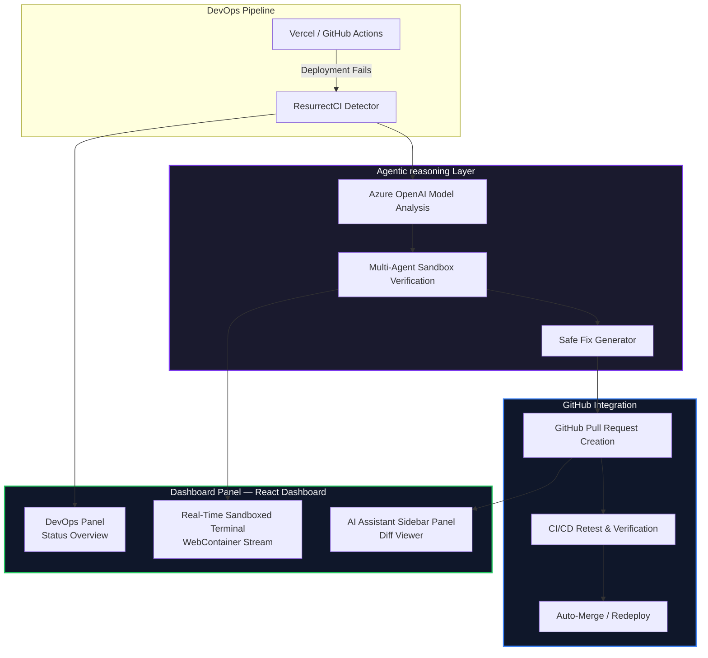

<p align="center">
  
  
  
  
</p>

# ResurrectCI  

**Autonomous Agentic DevOps & Reliability Engineering Platform.**

An autonomous AI-powered DevOps platform that leverages **Azure OpenAI (GPT-4o)** and **WebContainer Sandboxing** to automatically detect, analyze, verify, and fix CI/CD build failures without human intervention. Instead of just triggering alerts, ResurrectCI takes action to keep pipelines green.

<p align="center">
  <a href="#the-problem">The Problem</a> &bull;
  <a href="#the-solution">The Solution</a> &bull;
  <a href="#architecture-diagram">Architecture</a> &bull;
  <a href="#how-it-works---autonomous-pipeline">How It Works</a> &bull;
  <a href="#hero-technologies">Hero Tech</a> &bull;
  <a href="#agents-in-resurrectci">Agents</a> &bull;
  <a href="#dashboard-features">Dashboard</a> &bull;
  <a href="#quick-start">Quick Start</a>
</p>

---

## The Problem

Software delivery pipelines face critical delays when builds or deployments fail:

- **Static Alerting**: Traditional CI tools notify developers but leave them to dig through megabytes of raw logs.
- **Dependency Issues**: Upgrades or conflicts pause releases until manual patches are applied.
- **Idle Pipelines**: Broken builds on feature branches stall integrations for hours waiting on human review.
- **Untested Remedies**: Rolling back or fixing configuration live can cause unintended side effects without isolated validation.

## The Solution

ResurrectCI is a **multi-agent AI pipeline** that automates the incident response loop. It bridges the gap between alerting and resolution by autonomously writing remedies and validating them in a safe sandbox:

```
Build Fail --> ErrorDetector --> ContextAnalyzer --> SandboxVerifier --> FixGenerator --> PullRequestCreator
                  |                  |                    |                  |                    |
                  |                  |                    |                  |                    +-- Draft PR with fixes
                  |                  |                    |                  +-- Generates code diff patches
                  |                  |                    +-- Runs 'npm run build' safely in-browser
                  |                  +-- Contextual logs reasoning
                  +-- Automated failure detection
```

---

## Architecture Diagram


```mermaid
graph TB
    subgraph DevOps_Flow["DevOps Pipeline"]
        A[Vercel / GitHub Actions] -->|Deployment Fails| B[ResurrectCI Detector]
    end

    subgraph AI_Core["Agentic reasoning Layer"]
        B --> C[Azure OpenAI Model Analysis]
        C --> D[Multi-Agent Sandbox Verification]
        D --> E[Safe Fix Generator]
    end

    subgraph Github_Automation["GitHub Integration"]
        E --> F[GitHub Pull Request Creation]
        F --> G[CI/CD Retest & Verification]
        G --> H[Auto-Merge / Redeploy]
    end

    subgraph Workspace["Dashboard Panel — React Dashboard"]
        J[DevOps Panel<br/>Status Overview]
        K[Real-Time Sandboxed Terminal<br/>WebContainer Stream]
        L[AI Assistant Sidebar Panel<br/>Diff Viewer]
    end

    B --> J
    D --> K
    F --> L

    style AI_Core fill:#1a1a2e,stroke:#7c3aed,stroke-width:2px,color:#fff
    style Github_Automation fill:#0f172a,stroke:#3b82f6,stroke-width:2px,color:#fff
    style Workspace fill:#0f172a,stroke:#22c55e,stroke-width:2px,color:#fff
```

---

## Hero Technologies

### 1. WebContainer Sandboxing (Validation)
ResurrectCI mounts your repository files directly inside an isolated browser-side shell. 
- **In-Browser Node Environment**: Executes workflows like `npm install` and `npm run build` safely without risking host infrastructure.
- **Zero-Trust Verification**: Validates fixes generated by AI *before* creating a pull request, ensuring the patch actually solves the breaking error.

### 2. Azure OpenAI Reasoning Layer
Utilizes secure enterprise access keys for model reasoning.
- **Advanced Code Synthesis**: Backed by **Azure OpenAI GPT-4o** to comprehend stacktraces, resolve package conflicts, and identify logic flaws contextualized across files.
- **Automatic Fix Synthesis**: Generates accurate, modular git diff patches suitable for direct Pull Request provisioning.

### 3. Backend Microservices Architecture
Under the hood, a robust orchestration backend handles pipelining securely without exposing infrastructure details.
- **Edge Data Ingestion**: Manages incident streaming feed dynamically.
- **Trigger APIs**: Sequential execution triggers managing multi-step remediation sequences.

---

## How It Works — Autonomous Pipeline

```
  CI/CD Build Fails (Vercel / GitHub Actions)
         |
         v
  +------------------+
  | ResurrectCI      |  Detector Node
  | Event Ingestion  |
  +--------+---------+
           |
           | Triggers 4-stage sequential execution
           |
  +--------v---------+     Azure OpenAI Analysis
  | ErrorDetector     | --> Reads logs and classifies failure type
  +--------+---------+
           | detected logs + diagnostics
           |
  +--------v---------+     Azure OpenAI Contextual Reasoning
  | ContextAnalyzer   | --> Evaluates breaking triggers & diagnostics
  +--------+---------+
           | analyzed remedies
           |
  +--------v---------+     WebContainer Sandboxing
  | SandboxVerifier   | --> Executes `npm run build` in container
  | Reads / Writes    |     Validates AI patch verifies remedy passes
  +--------+---------+
           | verified remedies
           |
  +--------v---------+     GitHub Workspace Integration
  | FixGenerator     | --> Generates Git Diff instructions
  | Creates PRs      |     Creates branches, commits, draft PRs
  +--------+---------+
           |
           v
  Dashboard Displays Results with Full Evidence Trail
  (Automation Panel, Build Logs, Diff Viewer, Activity Feed)
```

---

## Agents in ResurrectCI

| Agent | Kind | Reasoning | Purpose |
|-------|------|-----------|---------|
| **ErrorDetector** | `analysis` | Azure OpenAI | Reads raw pipeline logs and identifies error type |
| **ContextAnalyzer** | `synthesis` | Azure OpenAI | Evaluates root causes and drafts potential patches |
| **SandboxVerifier** | `validation` | WebContainer | Mounts code to test execution sequences in isolation |
| **FixGenerator** | `remediation` | Azure OpenAI | Generates accurate Git Diffs pushes directly to GitHub branches |

---

## Dashboard Features

The React-powered dashboard provides a rich interface for DevOps tracking:

| Feature | Description |
|---------|-------------|
| **Automation Overview** | Real-time status list of running agents and fixes sequences. |
| **Sandbox Terminal** | Streaming views execution steps inside isolated WebContainers. |
| **Build Log Viewer** | Context highlighted failure trace review viewer. |
| **Diff Viewer Dialogs** | Side-by-side comparison previews showing fix branches created securely. |
| **GitHub Dashboard** | Repository and branch streams tracking connected workloads triggers. |

---

## Tech Stack

| Layer | Technology |
|-------|-----------|
| **AI Layer** | Azure OpenAI (GPT-4o Reasoning) |
| **Sandbox** | WebContainer API (In-Browser Node/Terminal workflows) |
| **Frontend** | React 18, Vite, TypeScript, Tailwind CSS, Shadcn/ui |
| **IDE Utils** | Monaco Editor, React Diff Viewer, Xterm.js |
| **Backend Core**| Node.js backend pipelines, PostgreSQL data layer, Edge Functions APIs |

---

## Project Structure

```text
resurrect-code/
├── backend/                  # Orchestration Backend Services
│   ├── server.js             # Main API Gateway entrypoint
│   └── services/             # Backend operations handlers
├── docs/                     # Static documentation & reports
├── public/                   # Static assets
└── src/                      # React Frontend Application
    ├── components/           # UI Components (Dashboard, Terminal)
    ├── hooks/                # Data fetching and workflows hooks
    ├── lib/                  # Configurations and mock clients
    ├── pages/                # App views & Navigation layouts
    └── services/             # API clients & streaming orchestration
```

## Quick Start

### 1. Clone & Install
```bash
git clone https://github.com/hackerpsyco/resurrect-code.git
cd resurrect-code
npm install
```

### 2. Environment Setup
Create a `.env` with critical keys:
```env
# Azure OpenAI configurations
AZURE_OPENAI_API_KEY=your_secure_azure_key
AZURE_OPENAI_ENDPOINT=https://your-endpoint.openai.azure.com/

# GitHub Workspace Integrations
GITHUB_TOKEN=your_github_token
```

### 3. Start Application
```bash
npm run dev 
# Dashboard available at http://localhost:5000 ok this will se code review ai  try where too slow
```

---

## Competitive Differentiation

| Capability | Standard CI Alerts | **ResurrectCI** |
|-----------|--------------------|----------------|
| **Detection** | Logs triggered | **LLM reasoning over context failures** |
| **Remediation** | None (Manual alerts) | **Self-healing remediation Generation** |
| **Verification** | Re-run on main | **Pre-verify safe in Sandboxed isolated containers** |
| **PR Provisioning** | Manual creation | **Autonomous Git Diff branch provisioning** |

---

<p align="center">
  Created for <strong>Microsoft AI Applications & Agents Hackathon</strong> to revolutionize CI pipeline reliability mechanics.
</p>
