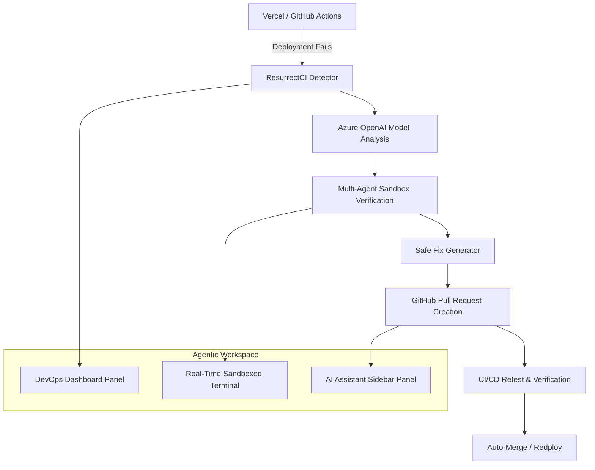

# 🤖 ResurrectCI - Autonomous Agentic DevOps & Reliability Engineering

[](https://opensource.org/licenses/MIT)
[](https://www.typescriptlang.org/)
[](https://reactjs.org/)
[](https://azure.microsoft.com/en-us/products/ai-services/openai-service/)

> **Autonomous AI-powered DevOps platform leveraging Microsoft Azure AI to automatically detect, analyze, and fix CI/CD build failures without human intervention.**

---

## 🚀 What is ResurrectCI?

ResurrectCI is a revolutionary **Agentic DevOps** automation platform designed to keep software delivery pipelines green. Instead of just monitoring and triggering alerts, ResurrectCI **takes action** leveraging **Azure OpenAI (GPT-4o)** model reasoning to:

- 🔍 **Detect** build and deployment failures in real-time
- 🧠 **Analyze** error logs contextually with advanced reasoning 
- 🛠️ **Generate code fixes** for dependencies, configuration, or syntax regressions
- 📝 **Orchestrate Multi-Step Workflows** for verification inside a sandbox WebContainer
- 🔀 **Create & Submit Pull Requests** with detailed automated solutions
- ✅ **Secure & Verify** fixes before auto-merging approved candidates

**No more broken builds sitting stalled in pipelines for hours. ResurrectCI resurrects them automatically!**

---

## ✨ Specialized Tech Capabilities (Microsoft AI Solution)

### 🤖 **Agentic Incident Response**
- **Autonomous Error Resolution**: Bridges the gap between alerting and resolving by actively writing remedies.
- **Advanced Code Reasoning**: Backed by **Azure OpenAI GPT-4o** to understand stacktraces, package conflicts, and logic flaws immediately.

### 🔄 **Multi-Agent Orchestration & Sandboxing**
- **WebContainer Sandboxing**: Mounts your repository files inside an isolated browser-side shell to execute `npm run build` safely locally testing remedies before patching!
- **Verifiers & Testers**: Separate analytical tasks validation checks prevent rolling updates that just break something else.

### 🛡️ **Enterprise-Grade CI Integration**
- **Automatic PR Provisioning**: Branches, fixes, and descriptive summaries pushes directly to GitHub securely.
- **Action Dashboard Review logs**: Single pane of glass for seeing exactly what fix branch has been pushed and why.

---

## 🏗️ Solution Architecture


```mermaid
graph TB
    A[Vercel / GitHub Actions] -->|Deployment Fails| B[ResurrectCI Detector]
    B --> C[Azure OpenAI Model Analysis]
    C --> D[Multi-Agent Sandbox Verification]
    D --> E[Safe Fix Generator]
    E --> F[GitHub Pull Request Creation]
    F --> G[CI/CD Retest & Verification]
    G --> H[Auto-Merge / Redploy]
    
    subgraph "Agentic Workspace"
        J[DevOps Dashboard Panel]
        K[Real-Time Sandboxed Terminal]
        L[AI Assistant Sidebar Panel]
    end
    
    B --> J
    D --> K
    F --> L
```

---

## 🛠️ Technology Stack (Azure Edition)

### **AI & Reasoning Layer**
- **Microsoft Azure OpenAI**: Powers fix synthesis & error review utilizing secure enterprise access keys.
- **Llama 3.3 Multi-Agent Handlers**: Support execution routines securely.

### **Frontend & Workspaces**
- **React 18** + TypeScript & Vite compilation.
- **Tailwind CSS & ShadCN/ui** aesthetics for responsive design layouts.
- **WebContainer API**: In-browser node environment verifying solutions instantly sequential.

### **Backend Core Services**
- **Node.js + Express**: Serves robust proxy API routing workflows dynamically.
- **PostgreSQL Database**: Storing logs, incidents feeds safely sequential.

---

## 🚀 Quick Start for Hackathon Testing

### 1. Clone and Install
```bash
git clone https://github.com/hackerpsyco/resurrect-code.git
cd resurrect-code
npm install
```

### 2. Environment Setup
Create a `.env` with critical keys:
```env
# Azure OpenAI configurations
AZURE_OPENAI_API_KEY=your_secure_azure_key
AZURE_OPENAI_ENDPOINT=https://your-endpoint.openai.azure.com/

# GitHub Workspace Integrations
GITHUB_TOKEN=your_github_token
```

### 3. Start Application
```bash
npm run dev
```

---

## 🏆 Hackathon Eligibility Categories Alignment

Perfectly qualified and targeting:
- **Challenge winner: Automate and Optimize Software Delivery - Agentic DevOps**: Built to securely fix incidents, auto-approve, and speed verification cycles reducing downtime directly.
- **Best Multi-Agent System**: Combines isolated browser Sandboxing verifying generation sequentially transparently alongside reasoning outputs.

---

## 🙏 Credits & Dedication
Created securely for **Microsoft AI Applications & Agents Hackathon** to revolutionize modern CI pipelines reliability mechanics.
